# Qt 软件管家 (Qt Software Manager) 设计文档

## 1. 概述

Qt 软件管家是一款基于 Qt 6.9 框架开发的桌面应用程序，旨在为用户提供高效管理、分类和快速启动计算机软件的解决方案。该工具能够自动扫描系统中的快捷方式，并允许用户手动添加软件，通过直观的界面进行分类管理。

### 1.1 核心目标
- 自动扫描系统快捷方式并手动添加软件
- 提供智能分类管理功能
- 实现直观的软件列表展示与快速启动
- 构建简洁美观的现代化用户界面

### 1.2 主要功能
- 自动扫描与手动添加快捷方式
- 智能分类管理（创建、编辑、删除分类）
- 直观的软件列表与一键启动
- 拖拽式分类分配
- 右键菜单功能（打开、打开文件位置、属性等）
- 全局快捷键支持（Ctrl+W快速启动）
- 系统托盘常驻后台运行
- 快速搜索和启动软件

### 1.3 项目价值
Qt 软件管家通过整合系统中分散的软件快捷方式，为用户提供统一的软件管理平台。该工具不仅能提升用户查找和启动软件的效率，还能通过分类管理帮助用户更好地组织软件资源，特别适合软件较多的用户使用。

## 2. 技术栈与架构

### 2.1 技术选型
- **编程语言**: C++17
- **GUI框架**: Qt 6.9
- **构建系统**: CMake 3.16+
- **数据持久化**: SQLite 数据库
- **图标处理**: Qt QIcon/QFileIconProvider
- **全局快捷键**: QHotkey 库
- **系统托盘**: Qt QSystemTrayIcon

### 2.1.1 QHotkey库集成说明
QHotkey是一个用于注册全局热键的Qt库，支持Windows、macOS和Linux平台。该库提供了简单易用的API来注册和管理全局快捷键，是实现Ctrl+W等全局快捷键功能的关键组件。

#### 集成步骤：
1. 通过Git子模块将QHotkey库添加到项目中
2. 在CMakeLists.txt中配置QHotkey库的编译和链接
3. 在GlobalHotkeyManager中使用QHotkey类注册和管理快捷键

#### 核心特性：
- 跨平台支持（Windows/macOS/Linux）
- 支持任意组合键
- 线程安全设计
- 信号槽机制集成

### 2.2 系统架构
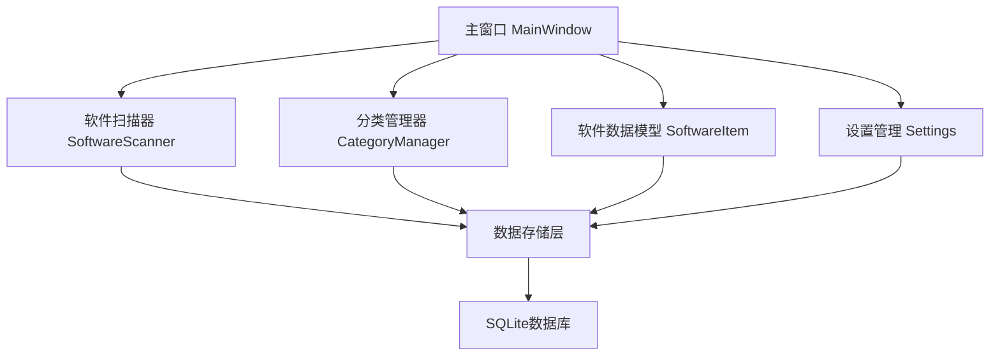
```mermaid
graph TD
    A[主窗口 MainWindow] --> B[软件扫描器 SoftwareScanner]
    A --> C[分类管理器 CategoryManager]
    A --> D[软件数据模型 SoftwareItem]
    A --> E[设置管理 Settings]
    B --> F[数据存储层]
    C --> F
    D --> F
    E --> F
    F --> G[SQLite数据库]
```

### 2.3 核心模块设计

#### 2.3.1 主窗口 (MainWindow)
- 承载所有UI组件
- 协调各模块间交互
- 处理用户输入事件
- 管理窗口状态和布局

#### 2.3.2 软件扫描器 (SoftwareScanner)
- 扫描系统目录中的快捷方式
- 解析快捷方式文件信息
- 转换为SoftwareItem对象
- 支持多线程扫描以提升性能

#### 2.3.3 软件数据模型 (SoftwareItem)
- 代表一个软件条目
- 封装软件元数据信息
- 提供数据验证和序列化功能

#### 2.3.4 分类管理器 (CategoryManager)
- 管理用户自定义分类
- 处理分类的CRUD操作
- 维护分类与软件的关联关系

#### 2.3.5 设置管理 (Settings)
- 管理应用程序配置
- 处理窗口状态持久化
- 管理用户自定义扫描路径

#### 2.3.6 系统托盘管理器 (SystemTrayManager)
- 管理系统托盘图标
- 处理托盘菜单交互
- 控制主窗口显示状态

#### 2.3.7 全局快捷键管理器 (GlobalHotkeyManager)
- 注册和管理全局快捷键
- 处理快捷键触发事件
- 映射快捷键到具体功能

## 3. 数据模型设计

### 3.1 SoftwareItem 类
代表一个软件条目，包含以下属性：

| 属性名 | 类型 | 描述 |
|--------|------|------|
| id | QString | 唯一标识符（UUID） |
| name | QString | 软件名称 |
| filePath | QString | 可执行文件或快捷方式路径 |
| category | QString | 所属分类 |
| icon | QIcon | 软件图标 |
| description | QString | 软件描述（可选） |
| version | QString | 软件版本（可选） |

#### 3.1.1 SoftwareItem 类图
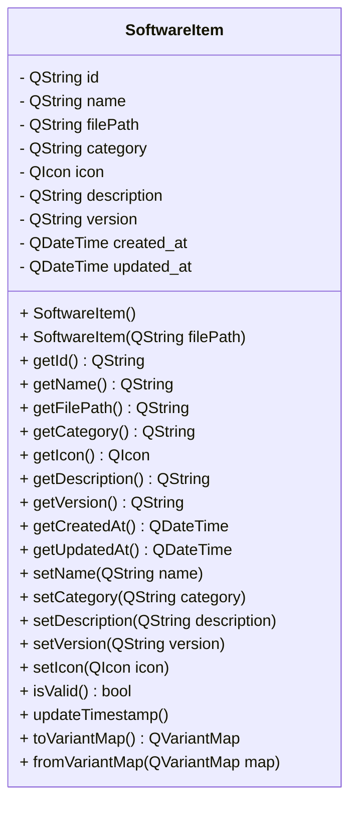
```mermaid
classDiagram
    class SoftwareItem {
        - QString id
        - QString name
        - QString filePath
        - QString category
        - QIcon icon
        - QString description
        - QString version
        - QDateTime created_at
        - QDateTime updated_at
        + SoftwareItem()
        + SoftwareItem(QString filePath)
        + getId() QString
        + getName() QString
        + getFilePath() QString
        + getCategory() QString
        + getIcon() QIcon
        + getDescription() QString
        + getVersion() QString
        + getCreatedAt() QDateTime
        + getUpdatedAt() QDateTime
        + setName(QString name)
        + setCategory(QString category)
        + setDescription(QString description)
        + setVersion(QString version)
        + setIcon(QIcon icon)
        + isValid() bool
        + updateTimestamp()
        + toVariantMap() QVariantMap
        + fromVariantMap(QVariantMap map)
    }
```

#### 3.1.2 SoftwareItem 实现细节
- **构造函数**: 支持默认构造和从文件路径构造
- **验证机制**: `isValid()` 方法检查软件条目是否有效
- **图标处理**: 使用 Qt 的 QIcon 类处理多尺寸图标
- **序列化**: 支持转换为 QVariantMap 用于存储
- **UUID生成**: 使用 QUuid 类生成唯一标识符
- **文件信息提取**: 使用 QFileInfo 提取文件名和元数据

#### 3.1.3 SoftwareItem 核心代码框架
```cpp
#ifndef SOFTWAREITEM_H
#define SOFTWAREITEM_H

#include <QString>
#include <QIcon>
#include <QDateTime>
#include <QFileInfo>
#include <QUuid>

class SoftwareItem {
public:
    // 构造函数
    SoftwareItem();
    explicit SoftwareItem(const QString& filePath);
    
    // 从数据库记录创建对象的构造函数
    SoftwareItem(const QString& id, const QString& name, const QString& filePath, 
                 const QString& category, const QString& description, 
                 const QString& version, const QDateTime& createdAt, 
                 const QDateTime& updatedAt);
    
    // Getter方法
    QString getId() const;
    QString getName() const;
    QString getFilePath() const;
    QString getCategory() const;
    QIcon getIcon() const;
    QString getDescription() const;
    QString getVersion() const;
    QDateTime getCreatedAt() const;
    QDateTime getUpdatedAt() const;
    
    // Setter方法
    void setName(const QString& name);
    void setCategory(const QString& category);
    void setDescription(const QString& description);
    void setVersion(const QString& version);
    void setIcon(const QIcon& icon);
    
    // 功能方法
    bool isValid() const;
    void updateTimestamp();
    
    // 数据库序列化方法
    QVariantMap toVariantMap() const;
    static SoftwareItem fromVariantMap(const QVariantMap& map);
    
private:
    QString m_id;
    QString m_name;
    QString m_filePath;
    QString m_category;
    QIcon m_icon;
    QString m_description;
    QString m_version;
    QDateTime m_createdAt;
    QDateTime m_updatedAt;
    
    // 私有辅助方法
    void initializeFromFilePath(const QString& filePath);
    QString extractNameFromPath(const QString& filePath) const;
};

#endif // SOFTWAREITEM_H
```

### 3.2 CategoryManager 类
提供分类管理接口：

| 方法 | 参数 | 返回值 | 描述 |
|------|------|--------|------|
| getCategories | 无 | QStringList | 获取所有分类列表 |
| addCategory | const QString &name | void | 添加新分类 |
| renameCategory | const QString &oldName, const QString &newName | void | 重命名分类 |
| removeCategory | const QString &name | void | 删除分类 |
| getCategoryCount | const QString &category | int | 获取分类中的软件数量 |
| moveSoftwareToCategory | const QString &softwareId, const QString &newCategory | bool | 移动软件到指定分类 |

#### 3.2.1 CategoryManager 类图
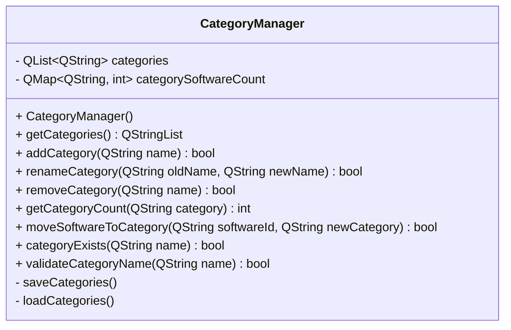
```mermaid
classDiagram
    class CategoryManager {
        - QList~QString~ categories
        - QMap~QString, int~ categorySoftwareCount
        + CategoryManager()
        + getCategories() QStringList
        + addCategory(QString name) bool
        + renameCategory(QString oldName, QString newName) bool
        + removeCategory(QString name) bool
        + getCategoryCount(QString category) int
        + moveSoftwareToCategory(QString softwareId, QString newCategory) bool
        + categoryExists(QString name) bool
        + validateCategoryName(QString name) bool
        - saveCategories()
        - loadCategories()
    }
```

#### 3.2.2 CategoryManager 实现细节
- **数据持久化**: 使用 QSettings 存储分类信息
- **名称验证**: `validateCategoryName()` 确保分类名称唯一且符合规范
- **事件通知**: 通过信号槽机制通知 UI 分类变化
- **线程安全**: 在多线程环境中使用互斥锁保护数据一致性
- **默认分类**: 提供"未分类"等默认分类
- **分类计数**: 维护每个分类中的软件数量

#### 3.2.3 CategoryManager 核心代码框架
```cpp
#ifndef CATEGORYMANAGER_H
#define CATEGORYMANAGER_H

#include <QObject>
#include <QStringList>
#include <QMap>
#include <QMutex>

class CategoryManager : public QObject {
    Q_OBJECT

public:
    explicit CategoryManager(QObject* parent = nullptr);
    
    // 分类管理方法
    QStringList getCategories() const;
    bool addCategory(const QString& name);
    bool renameCategory(const QString& oldName, const QString& newName);
    bool removeCategory(const QString& name);
    bool categoryExists(const QString& name) const;
    bool validateCategoryName(const QString& name) const;
    
    // 软件分类关联方法
    int getCategoryCount(const QString& category) const;
    bool moveSoftwareToCategory(const QString& softwareId, const QString& newCategory);
    
    // 默认分类
    QString getDefaultCategory() const;
    
signals:
    // 信号定义
    void categoryAdded(const QString& name);
    void categoryRemoved(const QString& name);
    void categoryRenamed(const QString& oldName, const QString& newName);
    void softwareCategoryChanged(const QString& softwareId, const QString& newCategory);
    
private:
    QStringList m_categories;
    QMap<QString, int> m_categorySoftwareCount;
    mutable QMutex m_mutex;
    
    // 私有方法
    void loadCategories();
    void saveCategories();
    bool isBuiltInCategory(const QString& name) const;
};

#endif // CATEGORYMANAGER_H
```

## 4. 业务逻辑层设计

### 4.1 SoftwareScanner 模块
负责扫描系统目录并解析快捷方式文件：
- Windows系统扫描路径：
  - `C:\ProgramData\Microsoft\Windows\Start Menu\Programs`
  - `C:\Users\%USERNAME%\Desktop`
- Linux系统扫描路径：
  - `/usr/share/applications`
  - `~/.local/share/applications`
- macOS系统扫描路径：
  - `/Applications`
  - `~/Applications`
  - `~/Desktop`

支持多线程扫描以提升性能，避免阻塞UI线程。

#### 4.1.4 SoftwareScanner 核心代码框架
```cpp
#ifndef SOFTWARESCANNER_H
#define SOFTWARESCANNER_H

#include <QObject>
#include <QThread>
#include <QStringList>
#include <QList>

class SoftwareItem;
class ScanWorker;

class SoftwareScanner : public QObject {
    Q_OBJECT

public:
    explicit SoftwareScanner(QObject* parent = nullptr);
    ~SoftwareScanner();
    
    // 扫描控制
    void scanSystemSoftware();
    void cancelScan();
    bool isCurrentlyScanning() const;
    
    // 路径管理
    void addCustomPath(const QString& path);
    void removeCustomPath(const QString& path);
    QStringList getScanPaths() const;
    void setScanPaths(const QStringList& paths);
    
    // 手动添加
    SoftwareItem createSoftwareItem(const QString& filePath);
    
signals:
    void scanStarted();
    void scanProgress(int progress);
    void scanFinished(const QList<SoftwareItem>& items);
    void scanCancelled();
    void scanError(const QString& error);
    
private:
    QStringList m_scanPaths;
    bool m_isScanning;
    QThread* m_workerThread;
    ScanWorker* m_worker;
    
    // 私有方法
    void setupDefaultPaths();
    QStringList getDefaultScanPaths() const;
    bool isValidExecutablePath(const QString& path) const;
};

// 工作线程类
class ScanWorker : public QObject {
    Q_OBJECT

public:
    explicit ScanWorker(const QStringList& paths, QObject* parent = nullptr);
    
public slots:
    void process();
    void cancel();
    
signals:
    void progress(int progress);
    void finished(const QList<SoftwareItem>& items);
    void cancelled();
    void error(const QString& error);
    
private:
    QStringList m_paths;
    bool m_cancelled;
    
    QList<SoftwareItem> scanDirectory(const QString& path);
    SoftwareItem parseShortcutFile(const QString& filePath);
    QIcon extractIcon(const QString& filePath);
};

#endif // SOFTWARESCANNER_H
```

#### 4.1.1 SoftwareScanner 类图
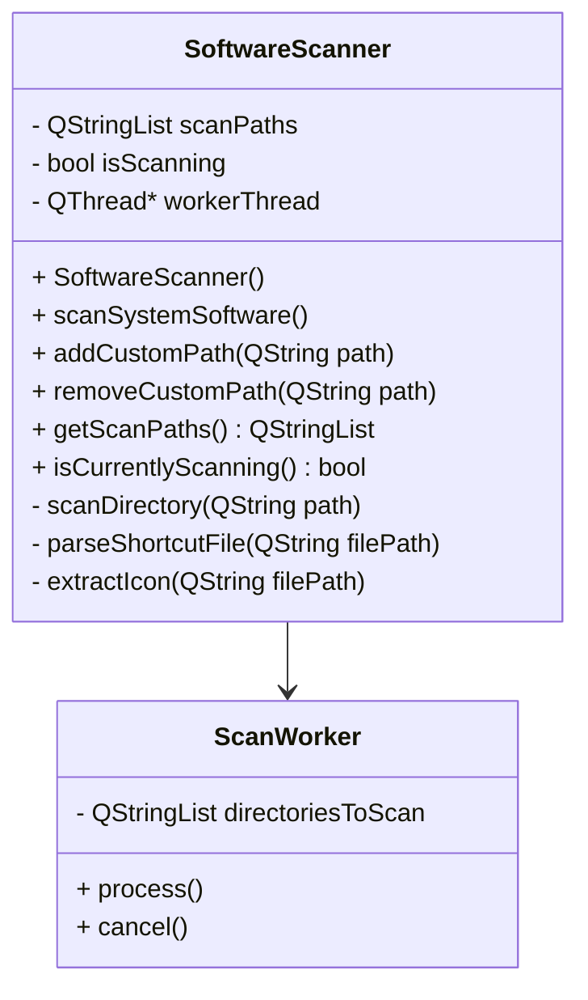
```mermaid
classDiagram
    class SoftwareScanner {
        - QStringList scanPaths
        - bool isScanning
        - QThread* workerThread
        + SoftwareScanner()
        + scanSystemSoftware()
        + addCustomPath(QString path)
        + removeCustomPath(QString path)
        + getScanPaths() QStringList
        + isCurrentlyScanning() bool
        - scanDirectory(QString path)
        - parseShortcutFile(QString filePath)
        - extractIcon(QString filePath)
    }
    
    class ScanWorker {
        - QStringList directoriesToScan
        + process()
        + cancel()
    }
    
    SoftwareScanner --> ScanWorker
```

#### 4.1.2 扫描流程图
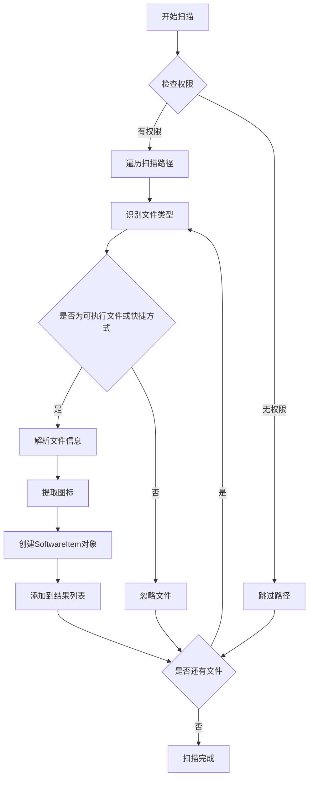
```mermaid
graph TD
    A[开始扫描] --> B{检查权限}
    B -->|有权限| C[遍历扫描路径]
    B -->|无权限| D[跳过路径]
    C --> E[识别文件类型]
    E --> F{是否为可执行文件或快捷方式}
    F -->|是| G[解析文件信息]
    F -->|否| H[忽略文件]
    G --> I[提取图标]
    I --> J[创建SoftwareItem对象]
    J --> K[添加到结果列表]
    K --> L{是否还有文件}
    L -->|是| E
    L -->|否| M[扫描完成]
    H --> L
    D --> L
```

#### 4.1.3 多线程扫描实现
- 使用 Qt 的 QThread 实现后台扫描
- 通过信号槽机制与主线程通信
- 支持扫描进度报告和取消操作
- 使用线程池管理多个扫描任务

### 4.2 软件启动功能
使用 `QProcess::startDetached(filePath)` 启动软件，确保主界面不会阻塞。启动前验证文件路径有效性，并提供启动失败的错误提示。

### 4.3 系统托盘与快捷键管理
#### 4.3.1 SystemTrayManager 模块
负责管理系统托盘图标和相关功能：
- 托盘图标创建和管理
- 托盘菜单创建和管理
- 托盘消息通知
- 主窗口显示/隐藏控制

#### 4.3.2 GlobalHotkeyManager 模块
负责注册和管理全局快捷键：
- 全局快捷键注册（使用QHotkey库）
- 快捷键事件处理
- 快捷键与功能映射

#### 4.3.3 实现细节
```cpp
// SystemTrayManager 实现示例
class SystemTrayManager : public QObject {
    Q_OBJECT

public:
    explicit SystemTrayManager(MainWindow* parent = nullptr);
    void setupTrayIcon();
    void showNotification(const QString& title, const QString& message);
    
private slots:
    void onTrayIconActivated(QSystemTrayIcon::ActivationReason reason);
    void toggleMainWindow();
    void quitApplication();
    
private:
    void createTrayMenu();
    
    QSystemTrayIcon* m_trayIcon;
    QMenu* m_trayMenu;
    MainWindow* m_mainWindow;
};

// GlobalHotkeyManager 实现示例
class GlobalHotkeyManager : public QObject {
    Q_OBJECT

public:
    explicit GlobalHotkeyManager(MainWindow* parent = nullptr);
    bool registerHotkeys();
    void unregisterHotkeys();
    
private slots:
    void onShowWindowHotkeyPressed();
    void onSearchHotkeyPressed();
    
private:
    QHotkey* m_showWindowHotkey;
    QHotkey* m_searchHotkey;
    MainWindow* m_mainWindow;
};
```

#### 4.3.4 SystemTrayManager 核心代码框架
```cpp
#ifndef SYSTEMTRAYMANAGER_H
#define SYSTEMTRAYMANAGER_H

#include <QObject>
#include <QSystemTrayIcon>

class QMenu;
class MainWindow;

class SystemTrayManager : public QObject {
    Q_OBJECT

public:
    explicit SystemTrayManager(MainWindow* parent = nullptr);
    ~SystemTrayManager();
    
    // 托盘管理
    void setupTrayIcon();
    void setTrayIcon(const QIcon& icon);
    bool isTrayAvailable() const;
    
    // 通知管理
    void showNotification(const QString& title, 
                         const QString& message,
                         QSystemTrayIcon::MessageIcon icon = QSystemTrayIcon::Information,
                         int millisecondsTimeoutHint = 10000);
    
    // 窗口控制
    void toggleMainWindow();
    void setMainWindow(MainWindow* window);
    
signals:
    void trayIconActivated(QSystemTrayIcon::ActivationReason reason);
    
private slots:
    void onTrayIconActivated(QSystemTrayIcon::ActivationReason reason);
    void onShowActionTriggered();
    void onHideActionTriggered();
    void onQuitActionTriggered();
    
private:
    void createTrayMenu();
    
    QSystemTrayIcon* m_trayIcon;
    QMenu* m_trayMenu;
    MainWindow* m_mainWindow;
    QAction* m_showAction;
    QAction* m_hideAction;
    QAction* m_quitAction;
};

#endif // SYSTEMTRAYMANAGER_H
```

### 4.4 数据持久化
使用 SQLite 数据库存储软件列表和分类关系，数据库文件存储在用户本地应用数据目录。数据库包含以下表结构：
- software_items: 存储软件条目信息
- categories: 存储分类信息
- software_category_mapping: 存储软件与分类的关联关系

## 5. UI/UX 设计

### 5.1 主界面布局
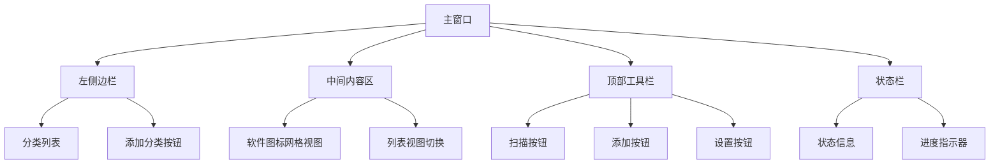
```mermaid
graph TD
    A[主窗口] --> B[左侧边栏]
    A --> C[中间内容区]
    A --> D[顶部工具栏]
    A --> E[状态栏]
    
    B --> B1[分类列表]
    B --> B2[添加分类按钮]
    
    C --> C1[软件图标网格视图]
    C --> C2[列表视图切换]
    
    D --> D1[扫描按钮]
    D --> D2[添加按钮]
    D --> D3[设置按钮]
    
    E --> E1[状态信息]
    E --> E2[进度指示器]
```

#### 5.1.1 UI组件层次结构
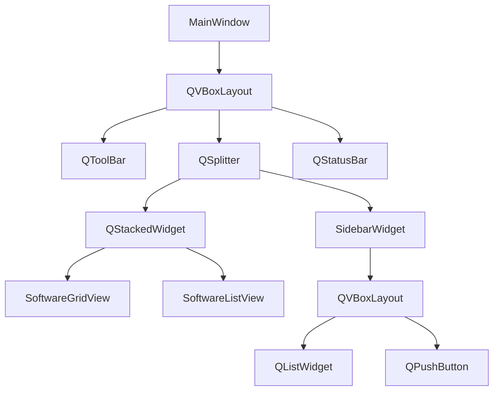
```mermaid
graph TD
    A[MainWindow] --> B[QVBoxLayout]
    B --> C[QToolBar]
    B --> D[QSplitter]
    B --> E[QStatusBar]
    D --> F[SidebarWidget]
    D --> G[QStackedWidget]
    G --> H[SoftwareGridView]
    G --> I[SoftwareListView]
    F --> J[QVBoxLayout]
    J --> K[QListWidget]
    J --> L[QPushButton]
```

#### 5.1.2 主窗口类图
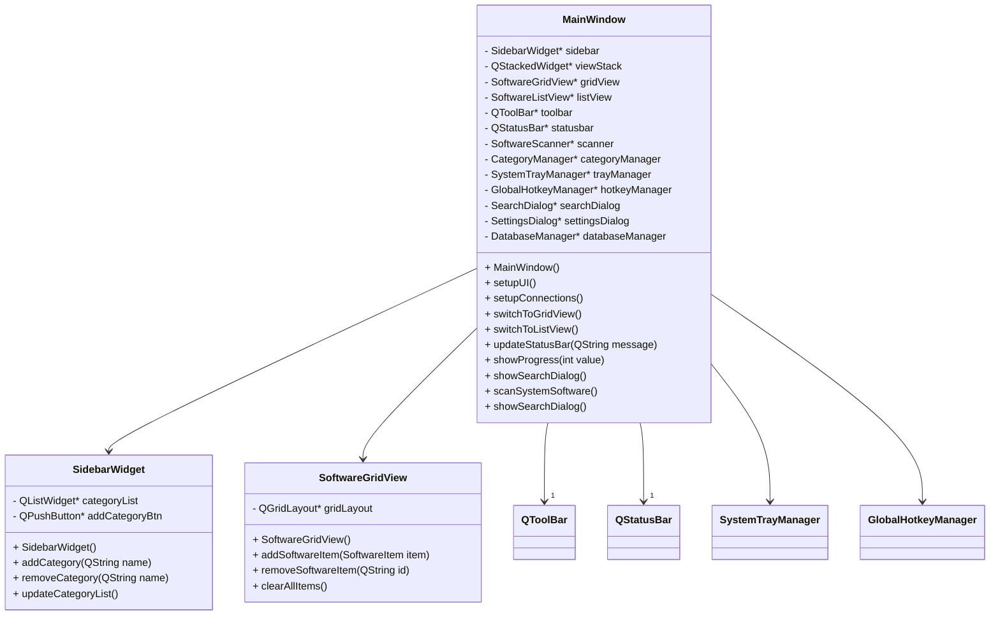
```mermaid
classDiagram
    class MainWindow {
        - SidebarWidget* sidebar
        - QStackedWidget* viewStack
        - SoftwareGridView* gridView
        - SoftwareListView* listView
        - QToolBar* toolbar
        - QStatusBar* statusbar
        - SoftwareScanner* scanner
        - CategoryManager* categoryManager
        - SystemTrayManager* trayManager
        - GlobalHotkeyManager* hotkeyManager
        - SearchDialog* searchDialog
        - SettingsDialog* settingsDialog
        - DatabaseManager* databaseManager
        + MainWindow()
        + setupUI()
        + setupConnections()
        + switchToGridView()
        + switchToListView()
        + updateStatusBar(QString message)
        + showProgress(int value)
        + showSearchDialog()
        + scanSystemSoftware()
        + showSearchDialog()
    }
    
    class SidebarWidget {
        - QListWidget* categoryList
        - QPushButton* addCategoryBtn
        + SidebarWidget()
        + addCategory(QString name)
        + removeCategory(QString name)
        + updateCategoryList()
    }
    
    class SoftwareGridView {
        - QGridLayout* gridLayout
        + SoftwareGridView()
        + addSoftwareItem(SoftwareItem item)
        + removeSoftwareItem(QString id)
        + clearAllItems()
    }
    
    MainWindow --> SidebarWidget
    MainWindow --> SoftwareGridView
    MainWindow --> "1" QToolBar
    MainWindow --> "1" QStatusBar
    MainWindow --> SystemTrayManager
    MainWindow --> GlobalHotkeyManager
```

#### 5.1.3 MainWindow 核心代码框架
```cpp
#ifndef MAINWINDOW_H
#define MAINWINDOW_H

#include <QMainWindow>
#include <QSystemTrayIcon>
#include <QHotkey>

// 前置声明
class SidebarWidget;
class SoftwareGridView;
class SoftwareListView;
class SoftwareScanner;
class CategoryManager;
class SystemTrayManager;
class GlobalHotkeyManager;
class SearchDialog;
class SettingsDialog;
class DatabaseManager;

class MainWindow : public QMainWindow {
    Q_OBJECT

public:
    MainWindow(QWidget* parent = nullptr);
    ~MainWindow();
    
protected:
    void closeEvent(QCloseEvent* event) override;
    
private slots:
    // UI事件处理
    void onScanButtonClicked();
    void onAddButtonClicked();
    void onSettingsButtonClicked();
    void onCategorySelected(const QString& category);
    void onSearchTriggered();
    void onViewModeChanged(bool isGridMode);
    
    // 系统托盘事件
    void onTrayIconActivated(QSystemTrayIcon::ActivationReason reason);
    
    // 快捷键事件
    void onShowWindowHotkeyPressed();
    void onSearchHotkeyPressed();
    
    // 扫描完成事件
    void onScanFinished(const QList<SoftwareItem>& items);
    
    // 软件项事件
    void onSoftwareItemLaunched(const QString& softwareId);
    void onSoftwareItemRemoved(const QString& softwareId);
    
private:
    // UI组件
    SidebarWidget* m_sidebar;
    QStackedWidget* m_viewStack;
    SoftwareGridView* m_gridView;
    SoftwareListView* m_listView;
    QToolBar* m_toolbar;
    QStatusBar* m_statusbar;
    
    // 核心管理器
    SoftwareScanner* m_scanner;
    CategoryManager* m_categoryManager;
    SystemTrayManager* m_trayManager;
    GlobalHotkeyManager* m_hotkeyManager;
    DatabaseManager* m_databaseManager;
    
    // 对话框
    SearchDialog* m_searchDialog;
    SettingsDialog* m_settingsDialog;
    
    // 私有方法
    void setupUI();
    void setupConnections();
    void setupTrayIcon();
    void setupHotkeys();
    void loadSettings();
    void saveSettings();
    void updateSoftwareList(const QString& category = QString());
    
    // 软件管理方法
    void addSoftwareManually();
    void launchSoftware(const QString& softwareId);
    void removeSoftware(const QString& softwareId);
    
public:
    // 公共方法供其他组件调用
    void showSearchDialog();
    void scanSystemSoftware();
};

#endif // MAINWINDOW_H
```

### 5.2 左侧边栏 (Sidebar)
- 显示分类列表（"所有软件"、"未分类"等）
- 顶部"＋"按钮用于添加新分类
- 支持分类重命名和删除操作
- 点击分类可过滤软件列表
- 分类支持折叠/展开功能

### 5.3 中间内容区 (Content Area)
- 使用网格视图展示软件图标和名称
- 支持列表视图和网格视图切换
- 支持拖拽操作分配分类
- 右键菜单提供多种操作选项
- 支持搜索和过滤功能
- 图标大小可调节

### 5.4 顶部工具栏 (Toolbar)
- "扫描"按钮：手动触发重新扫描
- "添加"按钮：手动添加软件
- "设置"按钮：打开设置对话框
- 视图切换按钮：网格/列表视图切换

### 5.5 状态栏 (Status Bar)
- 显示当前软件数量
- 显示扫描状态和进度
- 提供操作反馈信息

### 5.6 快捷键与系统托盘功能
#### 5.6.1 全局快捷键支持
- **Ctrl+W**: 快速显示/隐藏主窗口
- **Ctrl+Shift+F**: 快速搜索软件
- **Ctrl+Q**: 退出应用程序
- **Ctrl+R**: 重新扫描系统软件
- **Ctrl+N**: 新建分类

#### 5.6.2 系统托盘功能
- 应用程序最小化到系统托盘
- 托盘图标右键菜单包含常用功能
- 支持托盘图标双击显示主窗口
- 托盘消息提示重要操作结果

#### 5.6.3 快捷键实现架构
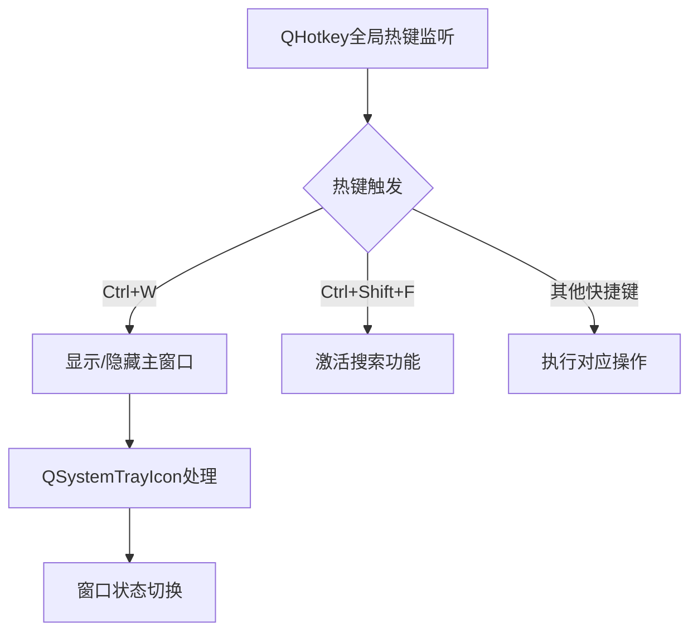
```mermaid
graph TD
    A[QHotkey全局热键监听] --> B{热键触发}
    B -->|Ctrl+W| C[显示/隐藏主窗口]
    B -->|Ctrl+Shift+F| D[激活搜索功能]
    B -->|其他快捷键| E[执行对应操作]
    C --> F[QSystemTrayIcon处理]
    F --> G[窗口状态切换]
```

#### 5.6.4 系统托盘类设计
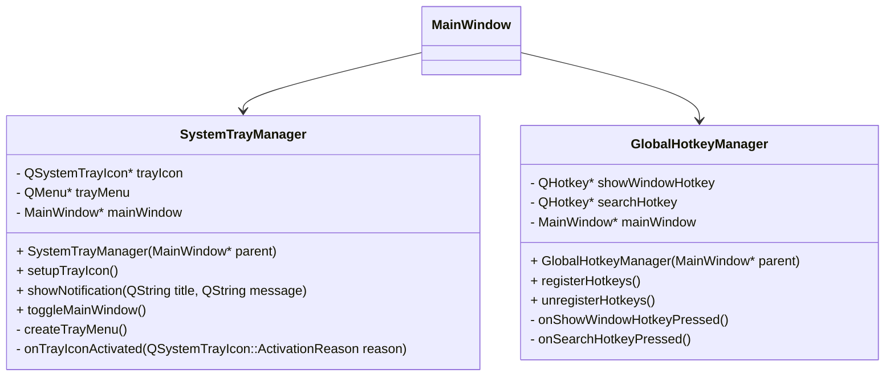
```mermaid
classDiagram
    class SystemTrayManager {
        - QSystemTrayIcon* trayIcon
        - QMenu* trayMenu
        - MainWindow* mainWindow
        + SystemTrayManager(MainWindow* parent)
        + setupTrayIcon()
        + showNotification(QString title, QString message)
        + toggleMainWindow()
        - createTrayMenu()
        - onTrayIconActivated(QSystemTrayIcon::ActivationReason reason)
    }
    
    class GlobalHotkeyManager {
        - QHotkey* showWindowHotkey
        - QHotkey* searchHotkey
        - MainWindow* mainWindow
        + GlobalHotkeyManager(MainWindow* parent)
        + registerHotkeys()
        + unregisterHotkeys()
        - onShowWindowHotkeyPressed()
        - onSearchHotkeyPressed()
    }
    
    MainWindow --> SystemTrayManager
    MainWindow --> GlobalHotkeyManager
```

## 6. 项目结构

```
QtSoftwareManager/
├── CMakeLists.txt
├── README.md
├── LICENSE
├── src/
│   ├── main.cpp
│   ├── core/
│   │   ├── SoftwareScanner.hpp
│   │   ├── SoftwareScanner.cpp
│   │   ├── CategoryManager.hpp
│   │   ├── CategoryManager.cpp
│   │   ├── SettingsManager.hpp
│   │   ├── SettingsManager.cpp
│   │   ├── SystemTrayManager.hpp
│   │   ├── SystemTrayManager.cpp
│   │   ├── GlobalHotkeyManager.hpp
│   │   ├── GlobalHotkeyManager.cpp
│   │   ├── DatabaseManager.hpp
│   │   └── DatabaseManager.cpp
│   ├── model/
│   │   ├── SoftwareItem.hpp
│   │   └── SoftwareItem.cpp
│   ├── ui/
│   │   ├── MainWindow.hpp
│   │   ├── MainWindow.cpp
│   │   ├── SidebarWidget.hpp
│   │   ├── SidebarWidget.cpp
│   │   ├── SoftwareGridView.hpp
│   │   ├── SoftwareGridView.cpp
│   │   ├── SoftwareListView.hpp
│   │   ├── SoftwareListView.cpp
│   │   ├── SoftwareItemWidget.hpp
│   │   ├── SoftwareItemWidget.cpp
│   │   ├── SearchDialog.hpp
│   │   ├── SearchDialog.cpp
│   │   ├── SettingsDialog.hpp
│   │   └── SettingsDialog.cpp
│   └── utils/
│       ├── IconExtractor.hpp
│       ├── IconExtractor.cpp
│       ├── Logging.hpp
│       └── Logging.cpp
├── resources/
│   ├── Resources.qrc
│   ├── icons/
│   └── styles/
├── data/
│   └── software.db
└── tests/
    ├── TestSoftwareItem.cpp
    ├── TestCategoryManager.cpp
    ├── TestSoftwareScanner.cpp
    └── TestDatabaseManager.cpp
```

### 6.1 目录结构说明

#### 6.1.1 src/ 目录
包含所有源代码文件，按照功能模块进行组织：
- **main.cpp**: 程序入口点
- **core/**: 核心业务逻辑模块
- **model/**: 数据模型定义
- **ui/**: 用户界面组件
- **utils/**: 工具类和辅助函数

#### 6.1.2 resources/ 目录
包含应用程序资源文件：
- **Resources.qrc**: Qt资源文件，包含图标、图片等资源
- **icons/**: 应用程序图标文件
- **styles/**: 样式表文件

#### 6.1.3 data/ 目录
用于存储应用程序数据：
- **software.db**: SQLite数据库文件，存储软件信息和分类数据

#### 6.1.4 tests/ 目录
包含单元测试和集成测试代码：
- 各个核心模块的测试文件
- 使用Qt Test框架编写

## 7. 验收标准

### 7.1 功能完整性
- [x] 应用程序成功编译并运行
- [x] 启动后能自动扫描并显示系统快捷方式
- [x] 可以成功通过点击启动软件
- [x] 可以创建新分类并将软件拖拽至新分类中
- [x] 视图能正确根据左侧选中的分类进行过滤
- [x] 重启应用程序后，自定义分类和软件分配关系得以保留
- [x] 支持手动添加软件快捷方式
- [x] 支持右键菜单功能（打开、打开文件位置、属性等）
- [x] 支持全局快捷键功能
- [x] 支持系统托盘功能
- [x] 支持搜索功能

### 7.2 代码质量
- [x] 代码结构清晰，模块化程度高
- [x] 注释充分，符合Qt编码规范
- [x] 使用现代C++和Qt 6.9特性
- [x] 处理常见异常情况（文件不存在、权限不足等）
- [x] 遵循RAII原则，正确管理资源
- [x] 使用智能指针管理动态内存

### 7.3 用户体验
- [x] 界面布局合理，美观简洁
- [x] 操作反馈及时
- [x] 启动软件时鼠标指针变为忙碌状态
- [x] 扫描过程显示进度指示
- [x] 支持键盘快捷键操作
- [x] 支持全局快捷键（Ctrl+W快速启动）
- [x] 支持系统托盘最小化运行
- [x] 支持托盘图标双击显示主窗口

## 8. 数据库设计

### 8.1 数据库表结构

#### 8.1.1 software_items 表
存储软件条目信息：

| 字段名 | 类型 | 约束 | 描述 |
|--------|------|------|------|
| id | TEXT | PRIMARY KEY | UUID唯一标识符 |
| name | TEXT | NOT NULL | 软件名称 |
| file_path | TEXT | NOT NULL | 可执行文件路径 |
| category | TEXT |  | 所属分类 |
| description | TEXT |  | 软件描述 |
| version | TEXT |  | 软件版本 |
| created_at | DATETIME | NOT NULL | 创建时间 |
| updated_at | DATETIME | NOT NULL | 更新时间 |

#### 8.1.2 categories 表
存储分类信息：

| 字段名 | 类型 | 约束 | 描述 |
|--------|------|------|------|
| id | INTEGER | PRIMARY KEY AUTOINCREMENT | 分类ID |
| name | TEXT | NOT NULL UNIQUE | 分类名称 |
| created_at | DATETIME | NOT NULL | 创建时间 |
| updated_at | DATETIME | NOT NULL | 更新时间 |

#### 8.1.3 software_category_relations 表
存储软件与分类的关联关系：

| 字段名 | 类型 | 约束 | 描述 |
|--------|------|------|------|
| software_id | TEXT | FOREIGN KEY | 软件ID |
| category_id | INTEGER | FOREIGN KEY | 分类ID |
| created_at | DATETIME | NOT NULL | 关联时间 |

#### 8.1.4 数据库关系图
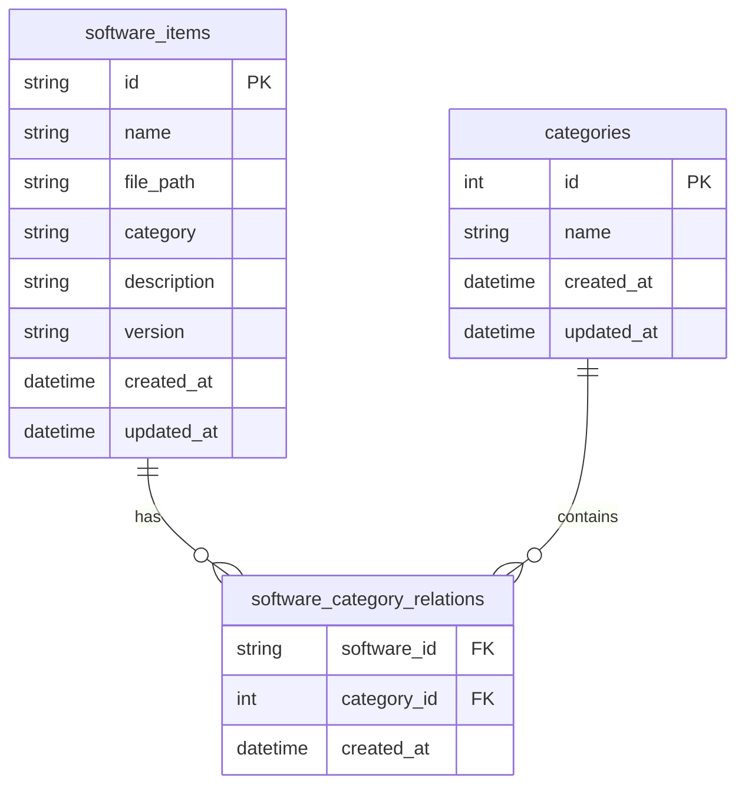
```mermaid
erDiagram
    software_items ||--o{ software_category_relations : "has"
    categories ||--o{ software_category_relations : "contains"
    
    software_items {
        string id PK
        string name
        string file_path
        string category
        string description
        string version
        datetime created_at
        datetime updated_at
    }
    
    categories {
        int id PK
        string name
        datetime created_at
        datetime updated_at
    }
    
    software_category_relations {
        string software_id FK
        int category_id FK
        datetime created_at
    }
```

#### 8.1.5 数据库访问层设计
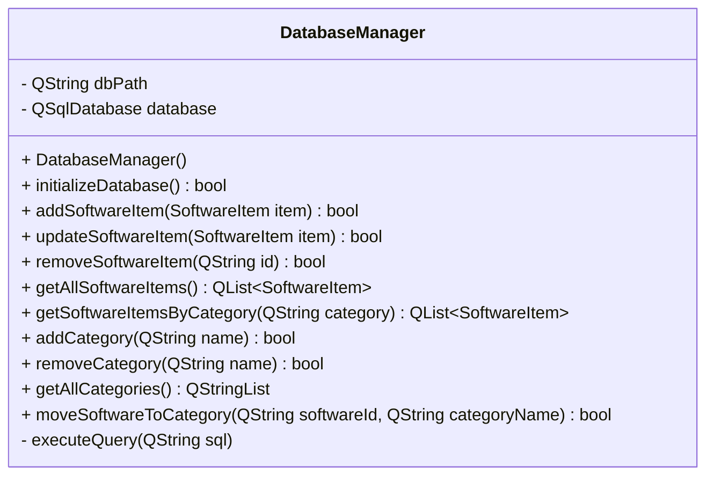
```mermaid
classDiagram
    class DatabaseManager {
        - QString dbPath
        - QSqlDatabase database
        + DatabaseManager()
        + initializeDatabase() bool
        + addSoftwareItem(SoftwareItem item) bool
        + updateSoftwareItem(SoftwareItem item) bool
        + removeSoftwareItem(QString id) bool
        + getAllSoftwareItems() QList~SoftwareItem~
        + getSoftwareItemsByCategory(QString category) QList~SoftwareItem~
        + addCategory(QString name) bool
        + removeCategory(QString name) bool
        + getAllCategories() QStringList
        + moveSoftwareToCategory(QString softwareId, QString categoryName) bool
        - executeQuery(QString sql)
    }
```

#### 8.1.6 DatabaseManager 核心代码框架
```cpp
#ifndef DATABASEMANAGER_H
#define DATABASEMANAGER_H

#include <QObject>
#include <QSqlDatabase>
#include <QList>
#include <QStringList>

class SoftwareItem;

class DatabaseManager : public QObject {
    Q_OBJECT

public:
    explicit DatabaseManager(QObject* parent = nullptr);
    ~DatabaseManager();
    
    // 数据库初始化
    bool initializeDatabase();
    bool isDatabaseValid() const;
    
    // 软件项管理
    bool addSoftwareItem(const SoftwareItem& item);
    bool updateSoftwareItem(const SoftwareItem& item);
    bool removeSoftwareItem(const QString& id);
    QList<SoftwareItem> getAllSoftwareItems();
    QList<SoftwareItem> getSoftwareItemsByCategory(const QString& category);
    SoftwareItem getSoftwareItemById(const QString& id);
    bool softwareItemExists(const QString& id);
    
    // 分类管理
    bool addCategory(const QString& name);
    bool removeCategory(const QString& name);
    QStringList getAllCategories();
    bool categoryExists(const QString& name);
    
    // 软件分类关联
    bool moveSoftwareToCategory(const QString& softwareId, const QString& categoryName);
    int getCategoryCount(const QString& category);
    
    // 批量操作
    bool batchInsertSoftwareItems(const QList<SoftwareItem>& items);
    bool batchUpdateSoftwareItems(const QList<SoftwareItem>& items);
    
    // 数据库维护
    bool backupDatabase(const QString& backupPath);
    bool restoreDatabase(const QString& backupPath);
    qint64 getDatabaseSize() const;
    
private:
    QString m_dbPath;
    QSqlDatabase m_database;
    
    // 私有方法
    bool createTables();
    bool executeQuery(const QString& sql);
    QString getDatabasePath() const;
    bool openDatabase();
    void closeDatabase();
    
    // 工具方法
    QString escapeString(const QString& str) const;
};

#endif // DATABASEMANAGER_H
```

#### 8.1.6 数据库实现细节
- 使用 Qt 的 QSqlDatabase 模块操作 SQLite
- 实现连接池管理数据库连接
- 使用事务确保数据一致性
- 支持数据库版本升级和迁移

## 9. API接口规范

### 9.1 SoftwareManager API
软件管理核心接口：

```cpp
// 扫描系统软件
void scanSystemSoftware();

// 添加软件
bool addSoftware(const QString& filePath);

// 删除软件
bool removeSoftware(const QString& softwareId);

// 获取所有软件
QList<SoftwareItem> getAllSoftware();

// 根据分类获取软件
QList<SoftwareItem> getSoftwareByCategory(const QString& category);

// 启动软件
bool launchSoftware(const QString& softwareId);

// 搜索软件
QList<SoftwareItem> searchSoftware(const QString& keyword);

// 获取软件详情
SoftwareItem getSoftwareDetails(const QString& softwareId);

// 更新软件信息
bool updateSoftware(const QString& softwareId, const SoftwareItem& updatedItem);
```

#### 9.1.1 SoftwareManager 类图
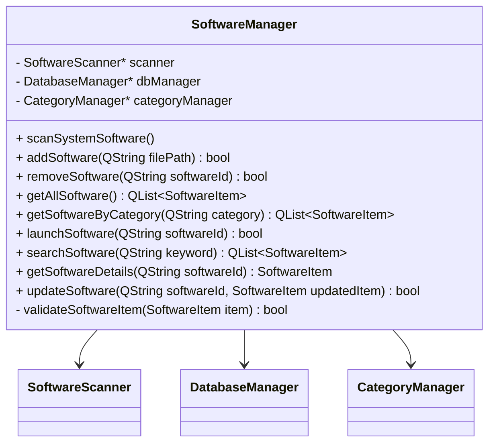
```mermaid
classDiagram
    class SoftwareManager {
        - SoftwareScanner* scanner
        - DatabaseManager* dbManager
        - CategoryManager* categoryManager
        + scanSystemSoftware()
        + addSoftware(QString filePath) bool
        + removeSoftware(QString softwareId) bool
        + getAllSoftware() QList~SoftwareItem~
        + getSoftwareByCategory(QString category) QList~SoftwareItem~
        + launchSoftware(QString softwareId) bool
        + searchSoftware(QString keyword) QList~SoftwareItem~
        + getSoftwareDetails(QString softwareId) SoftwareItem
        + updateSoftware(QString softwareId, SoftwareItem updatedItem) bool
        - validateSoftwareItem(SoftwareItem item) bool
    }
    
    SoftwareManager --> SoftwareScanner
    SoftwareManager --> DatabaseManager
    SoftwareManager --> CategoryManager
```

### 9.2 CategoryManager API
分类管理接口：

```cpp
// 获取所有分类
QStringList getCategories();

// 添加分类
bool addCategory(const QString& name);

// 重命名分类
bool renameCategory(const QString& oldName, const QString& newName);

// 删除分类
bool removeCategory(const QString& name);

// 获取分类中的软件数量
int getCategoryCount(const QString& category);

// 移动软件到指定分类
bool moveSoftwareToCategory(const QString& softwareId, const QString& newCategory);

// 检查分类是否存在
bool categoryExists(const QString& name);

// 获取默认分类
QString getDefaultCategory();
```

#### 9.2.1 CategoryManager 信号定义
```cpp
// 分类添加信号
void categoryAdded(const QString& name);

// 分类移除信号
void categoryRemoved(const QString& name);

// 分类重命名信号
void categoryRenamed(const QString& oldName, const QString& newName);

// 软件分类变更信号
void softwareCategoryChanged(const QString& softwareId, const QString& newCategory);
```

### 9.3 SystemTrayManager API
系统托盘管理接口：

```cpp
// 设置托盘图标
void setTrayIcon(const QIcon& icon);

// 显示托盘通知
void showNotification(const QString& title, const QString& message, QSystemTrayIcon::MessageIcon icon = QSystemTrayIcon::Information, int millisecondsTimeoutHint = 10000);

// 显示/隐藏主窗口
void toggleMainWindow();

// 设置主窗口
void setMainWindow(MainWindow* window);

// 检查托盘是否可用
bool isTrayAvailable() const;
```

### 9.4 GlobalHotkeyManager API
全局快捷键管理接口：

```cpp
// 注册快捷键
bool registerHotkey(const QKeySequence& sequence, const QString& name);

// 注销快捷键
void unregisterHotkey(const QString& name);

// 启用/禁用快捷键
void setHotkeyEnabled(const QString& name, bool enabled);

// 获取所有已注册的快捷键
QMap<QString, QKeySequence> getRegisteredHotkeys() const;

// 初始化默认快捷键
void initializeDefaultHotkeys();
```

#### 9.4.1 GlobalHotkeyManager 信号定义
```cpp
// 快捷键触发信号
void hotkeyPressed(const QString& name);

// 快捷键注册成功信号
void hotkeyRegistered(const QString& name);

// 快捷键注销信号
void hotkeyUnregistered(const QString& name);
```

#### 9.4.2 GlobalHotkeyManager 核心代码框架
```cpp
#ifndef GLOBALHOTKEYMANAGER_H
#define GLOBALHOTKEYMANAGER_H

#include <QObject>
#include <QKeySequence>
#include <QMap>

class QHotkey;
class MainWindow;

class GlobalHotkeyManager : public QObject {
    Q_OBJECT

public:
    explicit GlobalHotkeyManager(MainWindow* parent = nullptr);
    ~GlobalHotkeyManager();
    
    // 快捷键管理
    bool registerHotkey(const QKeySequence& sequence, const QString& name);
    void unregisterHotkey(const QString& name);
    void setHotkeyEnabled(const QString& name, bool enabled);
    bool isHotkeyRegistered(const QString& name) const;
    
    // 批量操作
    QMap<QString, QKeySequence> getRegisteredHotkeys() const;
    void initializeDefaultHotkeys();
    void unregisterAllHotkeys();
    
    // 配置管理
    void loadHotkeySettings();
    void saveHotkeySettings();
    
signals:
    void hotkeyPressed(const QString& name);
    void hotkeyRegistered(const QString& name);
    void hotkeyUnregistered(const QString& name);
    
private slots:
    void onShowWindowHotkeyPressed();
    void onSearchHotkeyPressed();
    void onQuitHotkeyPressed();
    void onScanHotkeyPressed();
    
private:
    QMap<QString, QHotkey*> m_hotkeys;
    MainWindow* m_mainWindow;
    
    // 私有方法
    void setupDefaultHotkeys();
    QString getHotkeyDescription(const QString& name) const;
};

#endif // GLOBALHOTKEYMANAGER_H
```

## 10. 构建与部署

### 10.1 构建系统配置
使用CMake作为构建系统，支持跨平台编译：

#### 10.1.2 项目依赖管理
Qt Software Manager项目依赖以下第三方库和组件：

1. **Qt 6.9框架**
   - QtCore: 核心功能模块
   - QtWidgets: UI组件模块
   - QtGui: 图形界面模块
   - QtSql: 数据库访问模块
   - QtTest: 测试框架模块

2. **QHotkey库**
   - 用于实现全局快捷键功能
   - 支持Windows、macOS和Linux平台
   - 需要作为Git子模块集成

3. **SQLite 3**
   - 通过QtSql模块访问
   - 用于本地数据存储

4. **C++标准库**
   - 使用C++17标准
   - STL容器和算法

#### 10.1.3 依赖集成方式
- **Qt框架**: 通过系统包管理器或Qt官方安装包安装
- **QHotkey**: 作为Git子模块集成到项目中
- **SQLite**: 通过QtSql模块间接使用，无需单独安装

#### 10.1.4 依赖配置脚本
项目提供依赖配置脚本以简化环境搭建：
- Windows: `setup_dependencies.bat`
- Linux/macOS: `setup_dependencies.sh`

这些脚本会自动下载和配置所需的依赖项。

```cmake
# CMakeLists.txt 示例
cmake_minimum_required(VERSION 3.16)
project(QtSoftwareManager VERSION 1.0.0)

set(CMAKE_CXX_STANDARD 17)
set(CMAKE_CXX_STANDARD_REQUIRED ON)

# 设置模块路径
set(CMAKE_MODULE_PATH ${CMAKE_MODULE_PATH} "${CMAKE_SOURCE_DIR}/cmake/")

# 查找Qt6组件
find_package(Qt6 REQUIRED COMPONENTS Core Widgets Sql Test)

# 启用自动MOC、RCC和UIC
set(CMAKE_AUTOMOC ON)
set(CMAKE_AUTORCC ON)
set(CMAKE_AUTOUIC ON)

# 添加QHotkey子模块
add_subdirectory(QHotkey)

# 包含目录
include_directories(${CMAKE_SOURCE_DIR}/src)
include_directories(${CMAKE_SOURCE_DIR}/src/core)
include_directories(${CMAKE_SOURCE_DIR}/src/model)
include_directories(${CMAKE_SOURCE_DIR}/src/ui)
include_directories(${CMAKE_SOURCE_DIR}/src/utils)
include_directories(${CMAKE_SOURCE_DIR}/QHotkey)

# 定义源文件
set(SOURCES
    src/main.cpp
    src/ui/MainWindow.cpp
    src/ui/SidebarWidget.cpp
    src/ui/SoftwareGridView.cpp
    src/ui/SoftwareListView.cpp
    src/ui/SoftwareItemWidget.cpp
    src/ui/SearchDialog.cpp
    src/ui/SettingsDialog.cpp
    src/core/SoftwareScanner.cpp
    src/core/CategoryManager.cpp
    src/core/SettingsManager.cpp
    src/core/SystemTrayManager.cpp
    src/core/GlobalHotkeyManager.cpp
    src/core/DatabaseManager.cpp
    src/model/SoftwareItem.cpp
    src/utils/IconExtractor.cpp
    src/utils/Logging.cpp
)

# 定义头文件
set(HEADERS
    src/ui/MainWindow.hpp
    src/ui/SidebarWidget.hpp
    src/ui/SoftwareGridView.hpp
    src/ui/SoftwareListView.hpp
    src/ui/SoftwareItemWidget.hpp
    src/ui/SearchDialog.hpp
    src/ui/SettingsDialog.hpp
    src/core/SoftwareScanner.hpp
    src/core/CategoryManager.hpp
    src/core/SettingsManager.hpp
    src/core/SystemTrayManager.hpp
    src/core/GlobalHotkeyManager.hpp
    src/core/DatabaseManager.hpp
    src/model/SoftwareItem.hpp
    src/utils/IconExtractor.hpp
    src/utils/Logging.hpp
)

# 添加资源文件
set(RESOURCES
    resources/Resources.qrc
)

# 添加可执行文件
add_executable(QtSoftwareManager
    ${SOURCES}
    ${HEADERS}
    ${RESOURCES}
)

# 链接Qt库和QHotkey
target_link_libraries(QtSoftwareManager 
    Qt6::Core 
    Qt6::Widgets 
    Qt6::Sql
    qhotkey
)

# 设置输出目录
set_target_properties(QtSoftwareManager PROPERTIES
    RUNTIME_OUTPUT_DIRECTORY ${CMAKE_BINARY_DIR}/bin
)

# 创建测试可执行文件
add_executable(TestSoftwareItem tests/TestSoftwareItem.cpp src/model/SoftwareItem.cpp src/utils/Logging.cpp)
target_link_libraries(TestSoftwareItem Qt6::Core Qt6::Test)

add_executable(TestCategoryManager tests/TestCategoryManager.cpp src/core/CategoryManager.cpp src/utils/Logging.cpp)
target_link_libraries(TestCategoryManager Qt6::Core Qt6::Test)

add_executable(TestSoftwareScanner tests/TestSoftwareScanner.cpp src/core/SoftwareScanner.cpp src/model/SoftwareItem.cpp src/utils/Logging.cpp)
target_link_libraries(TestSoftwareScanner Qt6::Core Qt6::Test)

add_executable(TestDatabaseManager tests/TestDatabaseManager.cpp src/core/DatabaseManager.cpp src/model/SoftwareItem.cpp src/utils/Logging.cpp)
target_link_libraries(TestDatabaseManager Qt6::Core Qt6::Sql Qt6::Test)

# 启用测试
enable_testing()

# 添加测试
add_test(NAME TestSoftwareItem COMMAND TestSoftwareItem)
add_test(NAME TestCategoryManager COMMAND TestCategoryManager)
add_test(NAME TestSoftwareScanner COMMAND TestSoftwareScanner)
add_test(NAME TestDatabaseManager COMMAND TestDatabaseManager)

# 安装规则
install(TARGETS QtSoftwareManager
    RUNTIME DESTINATION bin
)

# CPack配置（用于打包）
include(InstallRequiredSystemLibraries)
set(CPACK_PACKAGE_NAME "QtSoftwareManager")
set(CPACK_PACKAGE_VERSION_MAJOR "1")
set(CPACK_PACKAGE_VERSION_MINOR "0")
set(CPACK_PACKAGE_VERSION_PATCH "0")
set(CPACK_PACKAGE_DESCRIPTION_SUMMARY "Qt Software Manager")
include(CPack)
```

#### 10.1.1 项目依赖关系图
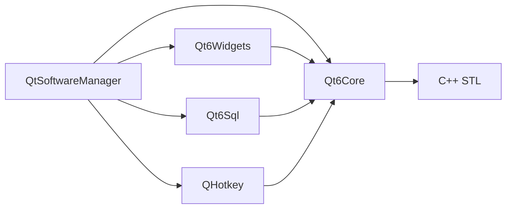
```mermaid
graph LR
    A[QtSoftwareManager] --> B[Qt6Core]
    A --> C[Qt6Widgets]
    A --> D[Qt6Sql]
    A --> E[QHotkey]
    B --> F[C++ STL]
    C --> B
    D --> B
    E --> B
```

### 10.2 跨平台支持
- Windows: 支持Windows 10/11
- macOS: 支持macOS 10.15及以上版本
- Linux: 支持主流Linux发行版（Ubuntu 20.04+, Fedora 35+）

### 10.3 部署方案
- Windows: 生成安装包(.exe)和便携版
- macOS: 生成.dmg镜像文件
- Linux: 生成.AppImage和.deb安装包

## 11. 性能优化

### 11.1 图标加载优化
- 使用线程池异步加载图标
- 实现图标缓存机制
- 支持图标尺寸缩放优化

#### 11.1.1 图标加载架构图
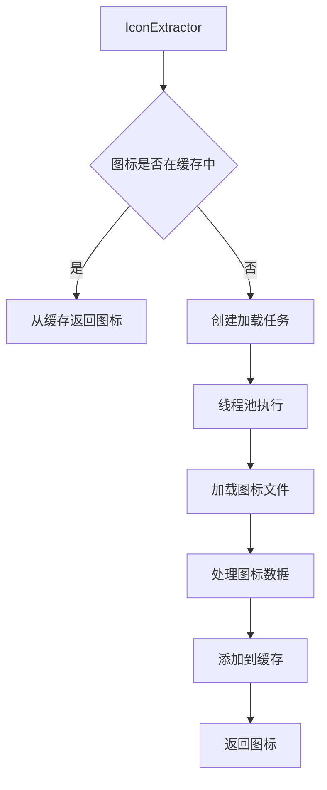
```mermaid
graph TD
    A[IconExtractor] --> B{图标是否在缓存中}
    B -->|是| C[从缓存返回图标]
    B -->|否| D[创建加载任务]
    D --> E[线程池执行]
    E --> F[加载图标文件]
    F --> G[处理图标数据]
    G --> H[添加到缓存]
    H --> I[返回图标]
```

#### 11.1.2 IconExtractor 类实现
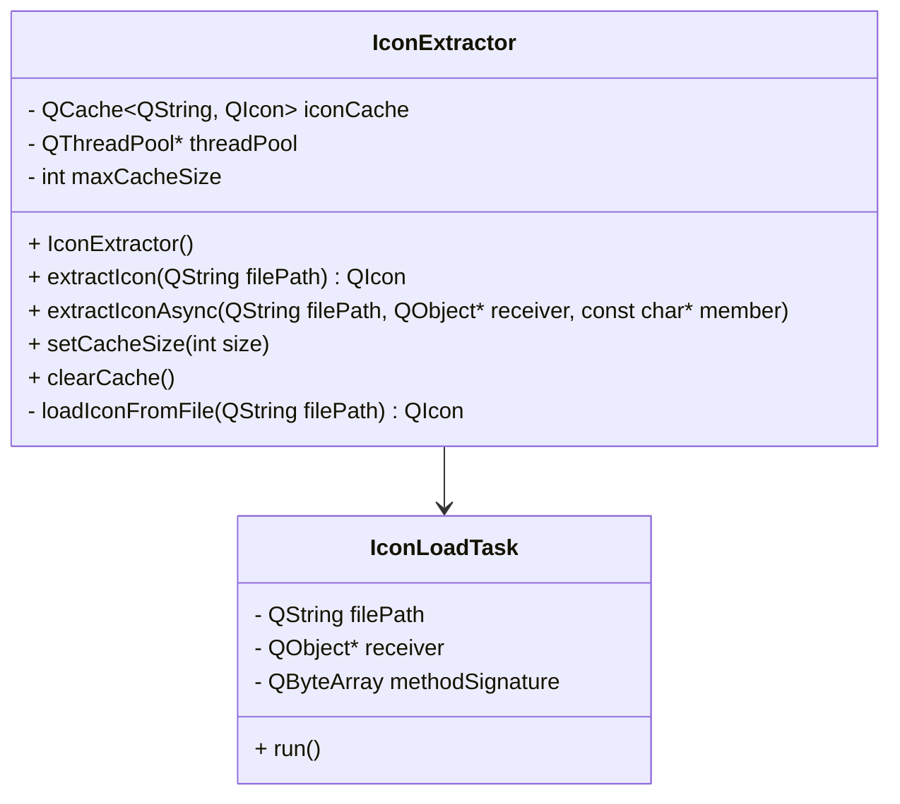
```mermaid
classDiagram
    class IconExtractor {
        - QCache~QString, QIcon~ iconCache
        - QThreadPool* threadPool
        - int maxCacheSize
        + IconExtractor()
        + extractIcon(QString filePath) QIcon
        + extractIconAsync(QString filePath, QObject* receiver, const char* member)
        + setCacheSize(int size)
        + clearCache()
        - loadIconFromFile(QString filePath) QIcon
    }
    
    class IconLoadTask {
        - QString filePath
        - QObject* receiver
        - QByteArray methodSignature
        + run()
    }
    
    IconExtractor --> IconLoadTask
```

### 11.2 数据库优化
- 使用数据库连接池
- 合理设置索引提升查询性能
- 批量操作减少数据库交互次数

#### 11.2.1 数据库索引策略
```sql
-- 为常用查询字段创建索引
CREATE INDEX idx_software_items_category ON software_items(category);
CREATE INDEX idx_software_items_name ON software_items(name);
CREATE INDEX idx_categories_name ON categories(name);
CREATE INDEX idx_relations_software_id ON software_category_relations(software_id);
CREATE INDEX idx_relations_category_id ON software_category_relations(category_id);
```

#### 11.2.2 批量操作示例
```cpp
// 批量插入软件项
bool DatabaseManager::batchInsertSoftwareItems(const QList<SoftwareItem>& items) {
    QSqlQuery query(database);
    query.prepare("INSERT INTO software_items (id, name, file_path, category, created_at, updated_at) "
                  "VALUES (?, ?, ?, ?, ?, ?)");
    
    // 开始事务
    database.transaction();
    
    for (const auto& item : items) {
        query.addBindValue(item.getId());
        query.addBindValue(item.getName());
        query.addBindValue(item.getFilePath());
        query.addBindValue(item.getCategory());
        query.addBindValue(QDateTime::currentDateTime());
        query.addBindValue(QDateTime::currentDateTime());
        
        if (!query.exec()) {
            database.rollback();
            return false;
        }
    }
    
    // 提交事务
    return database.commit();
}
```

### 11.3 界面响应优化
- 耗时操作使用QThread避免阻塞UI
- 实现懒加载机制
- 使用Qt的异步信号槽机制

#### 11.3.1 多线程架构图
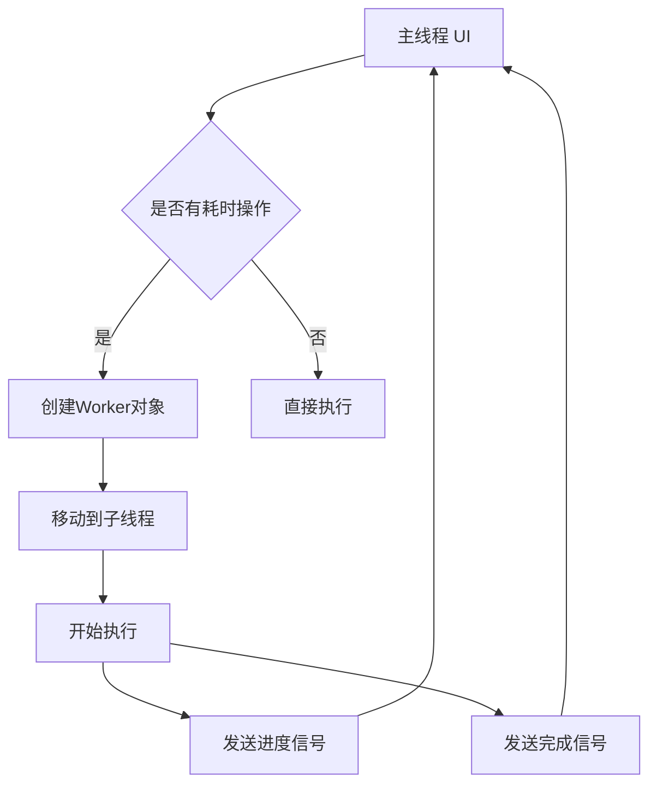
```mermaid
graph TD
    A[主线程 UI] --> B{是否有耗时操作}
    B -->|是| C[创建Worker对象]
    C --> D[移动到子线程]
    D --> E[开始执行]
    E --> F[发送进度信号]
    F --> A
    E --> G[发送完成信号]
    G --> A
    B -->|否| H[直接执行]
```

## 12. 安全性考虑

### 12.1 文件访问安全
- 验证文件路径合法性
- 检查文件执行权限
- 防止路径遍历攻击

### 12.2 数据安全
- 数据库存储加密敏感信息
- 防止SQL注入攻击
- 输入验证和过滤

## 13. 错误处理与日志记录

### 13.1 错误处理机制
- 使用Qt的信号槽机制传递错误信息
- 实现统一的异常捕获和处理框架
- 提供用户友好的错误提示
- 记录详细的错误日志便于问题排查

### 13.2 日志记录规范
- 使用Qt Logging Framework记录日志
- 按照日志级别分类记录（Debug、Info、Warning、Critical）
- 日志包含时间戳、模块名、线程ID等信息
- 支持日志文件滚动和大小限制

```cpp
// 日志记录示例
#include <QLoggingCategory>

Q_LOGGING_CATEGORY(softwareManager, "softwaremanager")

// 使用方式
qCInfo(softwareManager) << "软件扫描开始";
qCWarning(softwareManager) << "无法访问路径:" << path;
```

## 14. 测试策略

### 14.1 单元测试
- SoftwareItem类功能测试
- CategoryManager CRUD操作测试
- SoftwareScanner路径解析测试
- IconExtractor图标提取功能测试
- SettingsManager配置管理测试
- DatabaseManager数据库操作测试

#### 14.1.1 单元测试框架
使用Qt Test框架进行单元测试：

```cpp
// SoftwareItem测试示例
class TestSoftwareItem : public QObject {
    Q_OBJECT

private slots:
    void initTestCase();
    void testConstructor();
    void testValidation();
    void testSerialization();
    void cleanupTestCase();
};

void TestSoftwareItem::testConstructor() {
    // 测试默认构造函数
    SoftwareItem item;
    QVERIFY(!item.isValid());
    
    // 测试带路径的构造函数
    SoftwareItem item2("/path/to/app.exe");
    QVERIFY(item2.isValid());
    QCOMPARE(item2.getFilePath(), QString("/path/to/app.exe"));
}

QTEST_MAIN(TestSoftwareItem)
```

#### 14.1.2 测试覆盖率目标
- 核心业务逻辑覆盖率 ≥ 90%
- UI组件测试覆盖率 ≥ 80%
- 工具类测试覆盖率 ≥ 95%

### 14.2 集成测试
- 数据库读写功能测试
- UI交互流程测试
- 跨平台兼容性测试
- 拖拽功能测试
- 右键菜单功能测试
- 全局快捷键功能测试
- 系统托盘功能测试

#### 14.2.1 集成测试场景
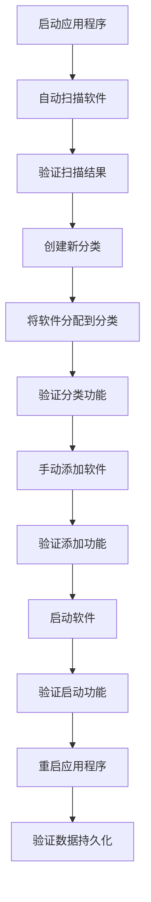
```mermaid
graph TD
    A[启动应用程序] --> B[自动扫描软件]
    B --> C[验证扫描结果]
    C --> D[创建新分类]
    D --> E[将软件分配到分类]
    E --> F[验证分类功能]
    F --> G[手动添加软件]
    G --> H[验证添加功能]
    H --> I[启动软件]
    I --> J[验证启动功能]
    J --> K[重启应用程序]
    K --> L[验证数据持久化]
```

### 14.3 性能测试
- 大量软件条目下的界面响应速度
- 快捷方式扫描性能测试
- 内存占用情况监控
- 启动时间测试

#### 14.3.1 性能测试指标
| 测试项 | 目标值 | 测试方法 |
|--------|--------|----------|
| 启动时间 | ≤ 2秒 | 从点击图标到主界面完全显示 |
| 扫描1000个软件 | ≤ 10秒 | 在标准配置机器上 |
| 界面响应延迟 | ≤ 100ms | 点击操作到界面响应 |
| 内存占用 | ≤ 100MB | 正常使用状态下 |
| 图标加载延迟 | ≤ 50ms | 单个图标加载时间 |

### 14.4 用户验收测试
- 功能完整性和正确性验证
- 界面易用性评估
- 不同操作系统环境下的稳定性测试

#### 14.4.1 用户验收测试用例
1. **基本功能测试**
   - 验证软件能正常启动
   - 验证自动扫描功能
   - 验证手动添加软件功能
   - 验证分类管理功能

2. **UI交互测试**
   - 验证拖拽功能
   - 验证右键菜单
   - 验证视图切换
   - 验证搜索功能

3. **快捷键与系统托盘测试**
   - 验证Ctrl+W快捷键显示/隐藏窗口功能
   - 验证系统托盘图标正常显示
   - 验证托盘图标双击显示主窗口
   - 验证托盘右键菜单功能
   - 验证其他全局快捷键功能

4. **兼容性测试**
   - Windows 10/11测试
   - macOS测试
   - Linux主流发行版测试

5. **稳定性测试**
   - 长时间运行测试
   - 大量数据处理测试
   - 异常情况处理测试

## 15. 实现计划

### 15.1 开发阶段划分
1. **第一阶段**: 基础框架搭建
   - [x] 创建项目结构和CMakeLists.txt配置
   - [x] 实现基础的MainWindow和UI组件
   - [x] 实现SoftwareItem数据模型

2. **第二阶段**: 核心功能开发
   - [x] 实现软件扫描功能(SoftwareScanner)
   - [x] 实现分类管理功能(CategoryManager)
   - [x] 实现数据库存储功能(DatabaseManager)

3. **第三阶段**: 高级功能开发
   - [x] 实现系统托盘功能(SystemTrayManager)
   - [x] 实现全局快捷键功能(GlobalHotkeyManager)
   - [x] 实现图标提取功能(IconExtractor)

4. **第四阶段**: 完善与测试
   - [x] 完善UI交互和用户体验
   - [x] 实现完整的测试套件
   - [x] 性能优化和bug修复

### 15.2 关键实现要点
- 遵循Qt最佳实践，使用信号槽机制进行组件间通信
- 采用多线程技术优化软件扫描性能
- 使用SQLite数据库确保数据持久化
- 实现RAII原则，正确管理资源
- 遵循模块化设计，确保代码可维护性

## 16. 总结

Qt 软件管家项目通过采用现代化的 Qt 6.9 框架和 C++17 标准，结合清晰的模块化设计，为用户提供了一个功能完善、界面友好的软件管理解决方案。该设计文档详细规划了系统的各个方面，从技术架构到用户界面，从数据模型到测试策略，确保项目能够高质量地完成开发并满足用户需求。

通过合理的架构设计和模块划分，该软件具备良好的可扩展性和可维护性，为后续功能迭代和优化提供了坚实的基础。同时，完善的测试策略和质量保证措施将确保软件的稳定性和可靠性。